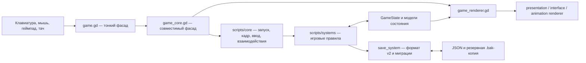

# Архитектура «Бабушкиной фермы»

Проект построен как набор узких игровых систем вокруг типизированного состояния. Сцена остаётся точкой интеграции Godot, но правила фермы, боя, экономики и прогресса не зависят от отрисовки.

## Общая схема



Главный принцип потока данных: **ввод вызывает операцию → система проверяет правило → модель изменяет состояние → renderer читает новое состояние**. Отрисовка не изменяет мир, а обработчик клавиши не содержит экономических или боевых правил.

## Композиционный слой

| Файл | Ответственность |
| --- | --- |
| `main.tscn` | Корневая сцена приложения |
| `scripts/game_context.gd` | Ресурсы сцены, совместимые свойства и общий контракт систем |
| `scripts/game.gd` | Тонкая точка подключения сцены без собственной логики |
| `scripts/game_core.gd` | Совместимый фасад игровых операций без реализации platform routing и preview |
| `scripts/core/game_bootstrap.gd` | Фазовая инициализация сервисов, мира, preview и runtime-систем |
| `scripts/core/game_loop.gd` | Единственный порядок обновления физического кадра и правила его остановки |
| `scripts/core/game_input_router.gd` | Приоритетная маршрутизация клавиатуры, мыши, геймпада и тача |
| `scripts/core/game_interaction_router.gd` | Выбор ближайшего взаимодействия и передача операции feature-системе |
| `scripts/core/game_preview_controller.gd` | Захват автоматических визуальных эталонов без загрязнения игрового цикла |
| `scripts/game_renderer.gd` | Совместимый фасад отрисовки мира и интерфейсов верхнего уровня |
| `scripts/presentation` | Небольшие тематические отрисовщики, которые только читают состояние |
| `scripts/editor` | Инструменты разработки и persistence их документов вне runtime-правил |
| `scripts/world_background.gd` | Фоновая геометрия и тайлы мира |

`game.gd` намеренно состоит только из наследования `game_core.gd`. Совместимые публичные операции остаются доступны сцене и тестам через core, но игровые правила делегируются профильным системам. Фасад не содержит методов `draw_*` и не владеет вторыми копиями игровых данных; свойства контекста проксируют значения в `GameState`.

Практическая карта каталогов, аналогии с веб-архитектурой и правила размещения нового файла находятся в [карте модулей](docs/MODULE_STRUCTURE.md).

## Модель состояния

```text
GameState
├── PlayerState      позиция, характеристики, профиль, отношения, диалог и визуальный отклик
├── InventoryState   количества, слоты, hotbar, экипировка, прочность и уровень рюкзака
├── WorldState       время, деньги, грядки, локация и изменяемые объекты мира
├── StorageState     установка и разреженное содержимое домашнего сундука
├── ForgeState       постоянные уровни улучшения экипировки
└── ContractState    ежедневные статусы, репутация и состояние доски гильдии
```

Модели наследуют `RefCounted`, не читают ввод и не зависят от `Node`. Это позволяет создавать состояние в тесте без запуска сцены. Временные состояния окон и анимаций остаются в контексте сцены, если они не являются частью сохраняемого прогресса.

## Владельцы игровых правил

| Подсистема | Единственная ответственность |
| --- | --- |
| `player_system.gd` | Движение, здоровье, опыт и кадр героя |
| `potion_system.gd` | Еда, восемь зелий, временные эффекты, невидимость и снятие скрытности атакой |
| `skill_system.gd` | Общий уровень героя, ремесленный опыт, восстановление ресурсов и бонусы рангов практики |
| `talent_system.gd` | Четыре ветки способностей, зависимости, расход очков уровня и постоянные игровые эффекты |
| `talent_renderer.gd` | Общая геометрия карточек для отрисовки, мыши и касания, линии зависимостей и XP-шкала |
| `navigation_system.gd` | Геометрия коллизий и проверка проходимости |
| `inventory_system.gd` | Каталог предметов, динамические слоты, hotbar и экипировка |
| `farm_system.gd` | Обработка грядок, четыре стадии роста и повторный полив |
| `fishing_system.gd` | Конечный автомат заброса, подсечки, физики рыбы, качества и сокровищ |
| `fishing_renderer.gd` | Экранные шкалы и процедурные пиктограммы рыбалки |
| `combat_system.gd` | Пять уровней врагов, AI движения и атак, масштабирование урона, опыта и добычи |
| `environment_hazard_system.gd` | Укоренённые контактные и дистанционные природные угрозы |
| `resource_system.gd` | Добыча камня и цветных кристаллов |
| `tree_system.gd` | Прочность деревьев, рубка, древесина, стадии восстановления и коллизии |
| `pirate_ship_system.gd` | Геометрия палубы, мачт, пушек и единые границы движения корабля |
| `pirate_ship_renderer.gd` | Статическое представление моря, корпуса, палубы, парусов и корабельного оборудования |
| `shop_system.gd` | Покупки, продажи и каталог товаров |
| `crafting_system.gd` | Рецепты и атомарные транзакции крафта |
| `storage_system.gd` | Установка домашнего сундука и атомарный перенос стеков между ним и рюкзаком |
| `forge_system.gd` | Стоимость, пределы и постоянные эффекты улучшений оружия, брони и стрел |
| `contract_system.gd` | Детерминированные ежедневные заказы, сдача предметов, награды и ранги гильдии |
| `quest_system.gd` | Пять последовательных сюжетных глав, десять побочных миссий, реестр 12 NPC, цели, состояния и награды |
| `tutorial_system.gd` | Последовательность полного обучения |
| `discovery_system.gd` | Радиус знакомства и одноразовые контекстные карточки |
| `wildlife_system.gd` | Блуждание, страх, охота и добыча животных |
| `forage_system.gd` | Возобновляемый дикий урожай и таймеры созревания |
| `loot_container_system.gd` | Сидированная расстановка тайников и случайная добыча |
| `world_system.gd` | Каталог локаций и переходы между ними |
| `building_system.gd` | Восемь внешних зданий, интерьерные локации, этажи и условия доступа |
| `companion_system.gd` | Найм, состав группы, следование и характеристики напарников |
| `save_system.gd` | Сериализация v2, миграция v1 и восстановление из backup |
| `locale_system.gd` | Каталог языков и разрешение локализованных строк |
| `audio_system.gd` | Темы локаций, адаптивный боевой кроссфейд и сигналы действий без громких шагов |
| `menu_system.gd` | Команды главного меню и паузы, универсальный ввод и временное `MenuState` |
| `settings_system.gd` | Постоянные параметры звука, окна, VSync и типизированное `SettingsState` |
| `animation_system.gd` | Состояния и временные шкалы анимаций |
| `animation_asset_registry.gd` | Стандарт 8 направлений × 3–5 кадров и полнота аудита движущихся типов |
| `adventure_polish_system.gd` | Создание героя, ветвящиеся диалоги, отношения, фиксация цели, прочность, ремонт и события отклика |
| `adventure_polish_renderer.gd` | Мини-карта, окна создания и диалога, телеграфы боя, следы и нарезка атласа эффектов |
| `npc_movement_system.gd` | Временные и погодные расписания, переходы между улицей и помещениями, безопасные маршруты жителей |
| `village_life_system.gd` | Вкусы подарков, дневные ограничения, отношения, реплики и личные поручения жителей |
| `village_event_system.gd` | Игровые правила ярмарки, праздника, ночного торговца и нападения на деревню |
| `interior_renderer.gd` | Тематические полы и атласная мебель отдельных помещений |
| `village_event_renderer.gd` | Визуальные объекты календарных событий на площади |
| `world_polish_renderer.gd` | Единая нарезка 5×4 атласа мебели, событий, оружия и частиц |
| `debug_playground_system.gd` | Изолированный стенд, пауза, покадровый шаг, инспектор и диагностические слои |
| `debug_overlay_system.gd` | Диагностика реальной проходимости, кэш видимой сетки, пауза и noclip поверх текущей локации |
| `debug_overlay_renderer.gd` | Цветная навигационная сетка, хитбоксы, маршруты, подписи и панель F11 |
| `first_level_art_system.gd` | Детерминированная нарезка master-арта первой локации на игровую сетку |
| `presentation_system.gd` | Чистые расчёты раскладки, направлений и общего профиля дыхания/шага |
| `visual_asset_system.gd` | Разметка сгенерированных атласов биомов, пиратов, предметов и зелий |
| `world_event_system.gd` | Чистый календарь сезонов, погода, рост культур, затмение и переход через портал |
| `atmosphere_renderer.gd` | Экранное освещение, свет домов, дождь, снег, гроза и луна без изменения состояния |

## Ввод, представление и контент

Эти компоненты связывают платформу и правила, но не владеют игровым прогрессом:

- `input_system.gd` регистрирует InputMap-действия, обеспечивает мгновенную реакцию и безопасное удержание;
- `presentation_system.gd` выполняет чистые расчёты atlas-кадров, координат и областей взаимодействия;
- `interface_renderer.gd` рисует HUD, рюкзак и модальные интерфейсы;
- `menu_renderer.gd` рисует главный экран, паузу и настройки по общим hit-зонам;
- `contract_renderer.gd` изолирует таблицу заказов и визуальное представление репутации гильдии;
- `animation_renderer.gd` рисует анимированные сущности и эффекты;
- `render_system.gd` определяет порядок слоёв мира;
- `content_registry.gd` проверяет ссылочную целостность data-driven каталогов.

Статический предмет объявляется один раз в `InventorySystem.ITEM_DATA`. Магазин, крафт, добыча, локализация и UI ссылаются на строковый идентификатор и не создают собственную конкурирующую модель предмета.

## Кадр игры

1. Godot передаёт событие через `game.gd` в `game_core.gd`.
2. `input_system` обновляет состояние удерживаемых клавиш или вызывает публичную операцию фасада.
3. Профильная система проверяет расстояние, ресурс, стоимость и допустимость перехода.
4. Система изменяет `GameState` и публикует результат через сообщение, звук или событие обучения.
5. `_process` обновляет время, календарные события, существ, эффекты и автоматы состояний.
6. `game_renderer` рисует мир, затем `atmosphere_renderer` накладывает погоду и освещение, а интерфейс остаётся незатемнённым.

## Сохранение

Сохраняемое состояние преобразуется в словарь только внутри `save_system.gd`. Запись атомарная: предыдущая полная версия остаётся в `.bak`. Загрузка сначала проверяет схему и типы, затем применяет миграцию и только после успеха заменяет живое состояние. Поэтому повреждённый или частично записанный JSON не должен оставлять игру наполовину загруженной.

Изменение схемы требует:

1. повысить номер версии;
2. добавить миграцию с предыдущей версии;
3. проверить новое сохранение, старое сохранение и повреждённый основной файл;
4. обновить [руководство игрока](docs/GAME_GUIDE.md), если сохраняется новая видимая сущность.

## Правила изменений

1. Новая механика расширяет единственного владельца ответственности или получает отдельную узкую систему.
2. UI и ввод вызывают публичную операцию; правила не дублируются в обработчиках клавиш.
3. Система не читает платформенный ввод и не рисует. Renderer не меняет игровое состояние.
4. `game.gd` не содержит реализацию, `game_core.gd` не рисует, а совместимое свойство не хранит вторую копию значения из `GameState`.
5. Новая пользовательская механика получает автотест, шаг туториала, пункт [QA_CHECKLIST.md](QA_CHECKLIST.md) и актуальную документацию.
6. Каждый метод документируется русским комментарием `##`; тест дополнительно описывает сценарий, исходное состояние и ожидание.
7. Архитектурные лимиты и ссылочная целостность проверяются `tools/check_architecture.sh`; превышение устраняется разбиением до merge.

Практический порядок работы и команды находятся в [руководстве разработчика](docs/DEVELOPMENT.md).
