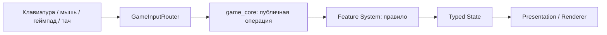

# Карта модулей проекта

Этот документ отвечает на практический вопрос: **куда положить новый код, чтобы проект не превратился в один большой файл**. В Godot сцены остаются точками интеграции, но правила, ввод, состояние и отрисовка разделяются так же строго, как controller, domain, store и view в веб-приложении.

## Структура каталогов

```text
scripts/
├── game.gd                 тонкая точка подключения главной сцены
├── game_context.gd         совместимые свойства и зависимости сцены
├── game_core.gd            публичный фасад игровых операций
├── game_renderer.gd        совместимый фасад отрисовки
├── core/                   жизненный цикл и маршрутизация
│   ├── game_bootstrap.gd
│   ├── game_loop.gd
│   ├── game_input_router.gd
│   ├── game_interaction_router.gd
│   └── game_preview_controller.gd
├── state/                  сохраняемые типизированные модели
├── systems/                правила отдельных игровых механик
├── presentation/           узкие отрисовщики без изменения состояния
├── editor/                 конструкторы и их файловые форматы
└── generated/              генерируемый код, если он появится
```

Тесты повторяют предметные области в `tests/suites`. Ресурсы располагаются по назначению в `assets/game`, а воспроизводимые контрольные изображения — в `assets/generated`.

## Аналогия с веб-разработкой

| Веб-понятие | Эквивалент проекта | Пример |
|---|---|---|
| Controller/router | `scripts/core` | `game_input_router.gd` выбирает получателя события |
| Application service | `game_core.gd` и orchestration | публичная операция `perform_context_action()` |
| Domain service | `scripts/systems` | `FishingSystem`, `FarmSystem`, `CombatSystem` |
| Entity/store | `scripts/state` | `PlayerState`, `InventoryState`, `WorldState` |
| View/presenter | `scripts/presentation` и `*renderer.gd` | `farm_renderer.gd`, `InterfaceRenderer` |
| Repository/serializer | узкий persistence-модуль | `SaveSystem`, `LevelEditorDocumentStore` |
| Fixture/storybook | preview-режимы | `GamePreviewController`, `UiPreviewSystem` |

## Как проходит одно действие



Маршрутизатор решает только **кому** отдать событие. Feature-система решает, **можно ли** выполнить действие и как изменить состояние. Renderer только читает результат.

## Правило размещения нового кода

1. Новое сохраняемое поле идёт в модель `scripts/state`, а его сериализация — в `SaveSystem`.
2. Новая механика получает один `*_system.gd` в `scripts/systems`; система не читает `Input` и не рисует.
3. Экранная геометрия и рисунок получают `*_renderer.gd`; renderer не выдаёт награды и не меняет мир.
4. Новый способ управления расширяет `scripts/core/game_input_router.gd` либо узкий feature-input-модуль.
5. Запуск, preview и порядок кадра меняются только в соответствующем модуле `scripts/core`.
6. Работа с отдельным файловым форматом живёт в `scripts/editor` или отдельном persistence-модуле, а не рядом с мышиной кистью.
7. Совместимый метод в `game_core.gd` может остаться коротким фасадом, если его вызывают сцена или тесты.

## Ограничения роста

- `game_core.gd` — не более 750 исполняемых строк;
- `game_renderer.gd` — не более 450 исполняемых строк;
- каждый orchestration-модуль в `scripts/core` — не более 260 исполняемых строк;
- `level_editor_system.gd` — не более 420 исполняемых строк;
- persistence-модуль редактора — не более 180 исполняемых строк;
- новый файл не должен объединять ввод, правила и отрисовку одновременно.

Лимиты проверяет `tools/check_architecture.sh`. Если файл приблизился к пределу, сначала выделяется ответственность и только потом добавляется следующая функция.

## Текущие владельцы крупных потоков

| Поток | Владелец |
|---|---|
| Запуск и аргументы preview | `scripts/core/game_bootstrap.gd` |
| Порядок физического кадра | `scripts/core/game_loop.gd` |
| Платформенный ввод | `scripts/core/game_input_router.gd` |
| Поиск и выполнение взаимодействия | `scripts/core/game_interaction_router.gd` |
| Автоматический захват кадров | `scripts/core/game_preview_controller.gd` |
| Рисование грядок и роста | `scripts/presentation/farm_renderer.gd` |
| JSON конструктора уровней | `scripts/editor/level_editor_document_store.gd` |
| Избранное конструктора | `scripts/editor/level_editor_preferences_store.gd` |
| Заливка и пипетка конструктора | `scripts/systems/level_editor_tool_system.gd` |

[К архитектуре](../ARCHITECTURE.md) · [К разработке](DEVELOPMENT.md) · [К навигатору документации](README.md)
