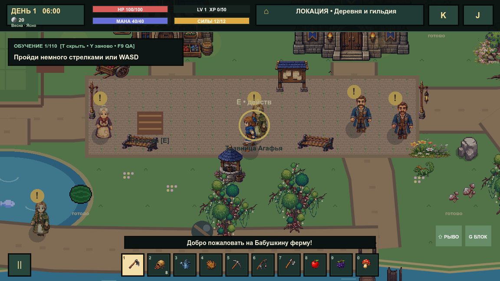
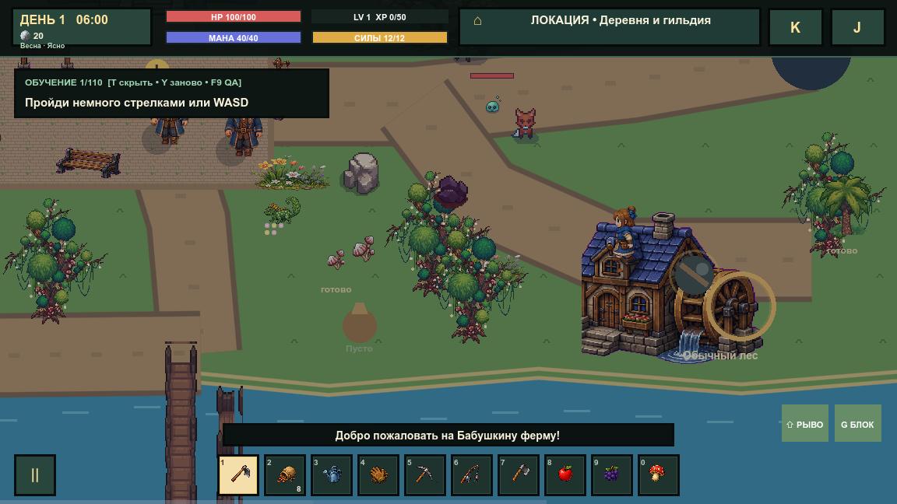

# Концепты первой локации

Все варианты показывают игровую сцену сверху в целевом 32-битном стиле. Они используют визуальный язык текущих зданий, сезонных деревьев, растений и мостов проекта. Это ориентиры для построения карты, а не готовые фоны: дорожки, вода, ограды и объекты должны стать отдельными слоями с коллизиями.

## 1. Деревня-кольцо

Центральное дерево и кольцевая дорога образуют простой ориентир. Дом и грядки находятся внизу, общественные здания — сверху, пруд — справа. Вариант лучше всего подходит для обучения и коротких маршрутов между основными сервисами.

## 2. Речная долина

Река делит карту на сельскую и общественную части. Мосты создают основные маршруты и полезные сокращения, а мельница становится сильным визуальным ориентиром. Вариант лучше всего передаёт ощущение живого мира.

## 3. От фермы к приключению

Карта постепенно переходит от безопасного дома через торговую площадь к шахте, руинам, лесу и лунному святилищу. Y-образная главная дорога естественно объясняет развитие игры и поддерживает сюжетную RPG-структуру.

## Рекомендуемая основа

Взять третий вариант как макет прогрессии, центральную площадь и короткое дорожное кольцо — из первого, а реку, два моста и мельницу — из второго. При переносе сохранить свободное пространство перед дверями, ширину основных проходов не меньше трёх клеток и отдельные карманы для NPC, ресурсов и обучения.

## Как локация устроена в игре

Первая локация реализуется гибридно, а не одной полноэкранной картинкой:

- земля и мелкая трава — дешёвый повторяемый базовый слой;
- дороги и берега — отдельные маршруты, которые можно менять без перерисовки карты;
- вода — самостоятельный слой с формой берега, бликами и проверяемой коллизией;
- дома, деревья, мосты, мельница, колодец и декор — независимые спрайты из атласов;
- персонажи, урожай, погода и эффекты — динамические анимированные слои;
- коллизии и навигация используют те же данные планировки, что и изображение.

Такой подход сохраняет нарисованный 32-битный вид концепта, но позволяет делать времена года, рубить деревья, ремонтировать мосты, открывать здания и перестраивать деревню. Цельный фон допустим только как далёкая недоступная декорация; игровую поверхность из него делать не следует.

## Контрольные снимки реализации

